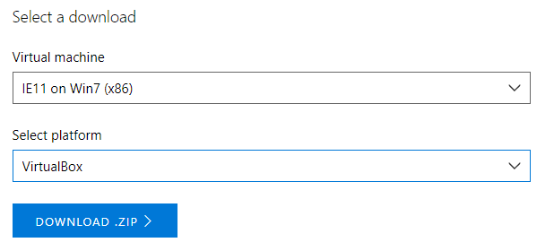
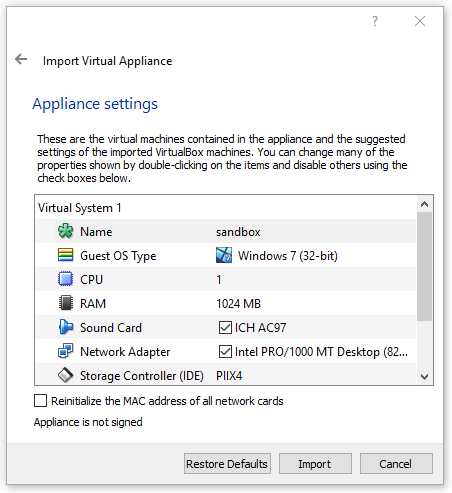

# Installing initial VM

The first thing we need for running our samples and PoCs into Sysmon sandbox is to download some OS images and a virtualization software. In this little tutorial we will use `VirtualBox` and free VMs provided by `Microsoft`. You can find it here:

* VirtualBox: https://www.virtualbox.org/wiki/Downloads
* Windows VMs: https://developer.microsoft.com/en-us/microsoft-edge/tools/vms/

Download the VM selecting the version that you want (`Windows 7`, `Windows 10`) and the corresponding platform.

Download the `zip` file and extract it, now we should have the `ova` file. We can import it with VirtualBox `File -> Import Appliance`. 

Adjust some settings like Name and RAM then click `Import` to finish.

